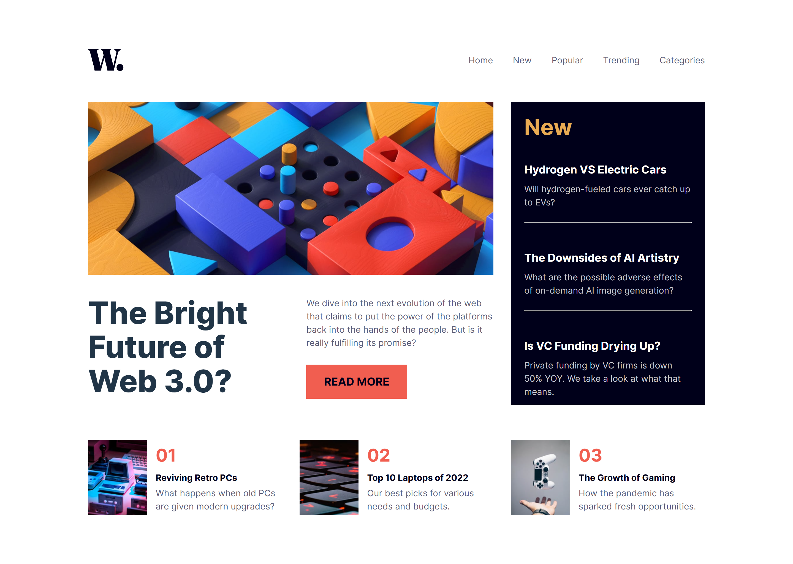

# Frontend Mentor - News homepage solution

This is a solution to the [News homepage challenge on Frontend Mentor](https://www.frontendmentor.io/challenges/news-homepage-H6SWTa1MFl). Frontend Mentor challenges help you improve your coding skills by building realistic projects. 

## Table of contents

- [Overview](#overview)
  - [The challenge](#the-challenge)
  - [Screenshot](#screenshot)
  - [Links](#links)
- [My process](#my-process)
  - [Built with](#built-with)
  - [What I learned](#what-i-learned)
  - [Continued development](#continued-development)
  - [Useful resources](#useful-resources)
- [Author](#author)
- [Acknowledgments](#acknowledgments)

## Overview

### The challenge

Users should be able to:

- View the optimal layout for the interface depending on their device's screen size
- See hover and focus states for all interactive elements on the page

### Screenshot

### Links

- Solution URL: [My solution](https://github.com/Ghozy165/news-homepage)
- Live Site URL: [My live site](https://news-homepage-psi-beige.vercel.app)

## My process

### Built with

- Semantic HTML5 markup
- CSS custom properties
- Flexbox
- CSS Grid
- Mobile-first workflow
- [React](https://reactjs.org/) - JS library

### What I learned

- CSS grid: make responsive layout
- React: component base UI

### Continued development

In my opinion using react base component can easier to make sure the HTML structure in WCAG and ARIA correct more easier

### Useful resources

- [Improve Responsiveness](https://utopia.fyi/) - This helped me for make responsiveness easier

- Frontend Mentor - [@Ghozy165](https://www.frontendmentor.io/profile/Ghozy165)

## Acknowledgments

thanks to frontend mentor that inspiring and guide to enhance skill in frontend development